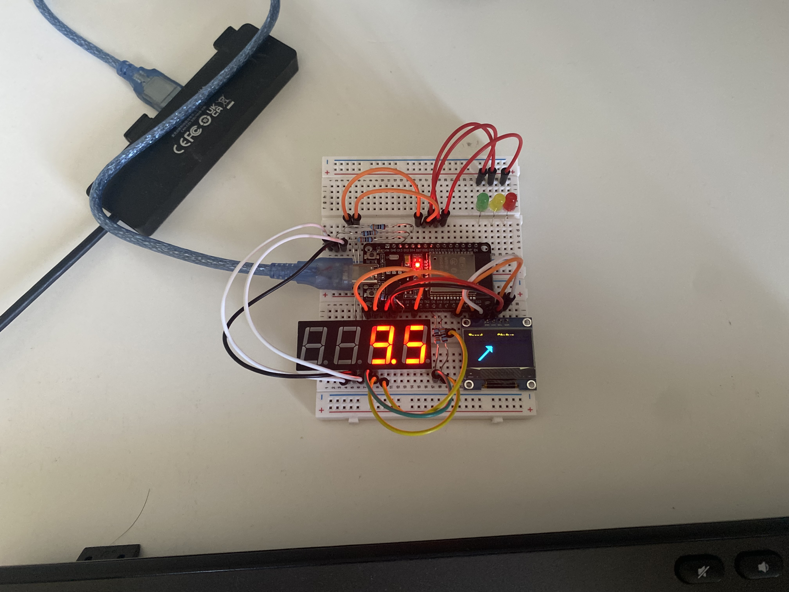

  

## About Me

I graduated from Queen's University with the BASc in Mathematics and Engineering, specializing in Systems and Robotics. I'm interested in the field of medical robotics and devices, looking to make an impact on peoples lives in health care using engineering innovation. Broadly, my interestes are:
- Computer Vision
- Robotics & Automation
- Embedded Systems
- AI & Intelligent Systems
This portfolio showcases engineering projects completed through personal work, research, and internship opportunities.

---

## Featured Projects

  <a href="projects/t1-dashboard.md" style="text-decoration: none; color: inherit; border: 1px solid #ddd; border-radius: 8px; overflow: hidden; transition: transform 0.2s; display: block;">
    
    

      <h3 style="margin-top: 0;">Type 1 Diabetes Dashboard</h3>
      
Physical dashboard representing Continuous Glucose Monitor data.

    

  </a>

  <a href="projects/beckhoff_xplanar.md" style="text-decoration: none; color: inherit; border: 1px solid #ddd; border-radius: 8px; overflow: hidden; transition: transform 0.2s; display: block;">
    
    

      <h3 style="margin-top: 0;">XPlanar Stereovision</h3>
      
Real-time stereovision system for object tracking and pose estimation.

    

  </a>

  

---

## Contact

- [LinkedIn](https://www.linkedin.com/in/mateo-huster)
- [GitHub](https://github.com/mateoh540)
- [Email](mailto:mateo@huster.ca)
