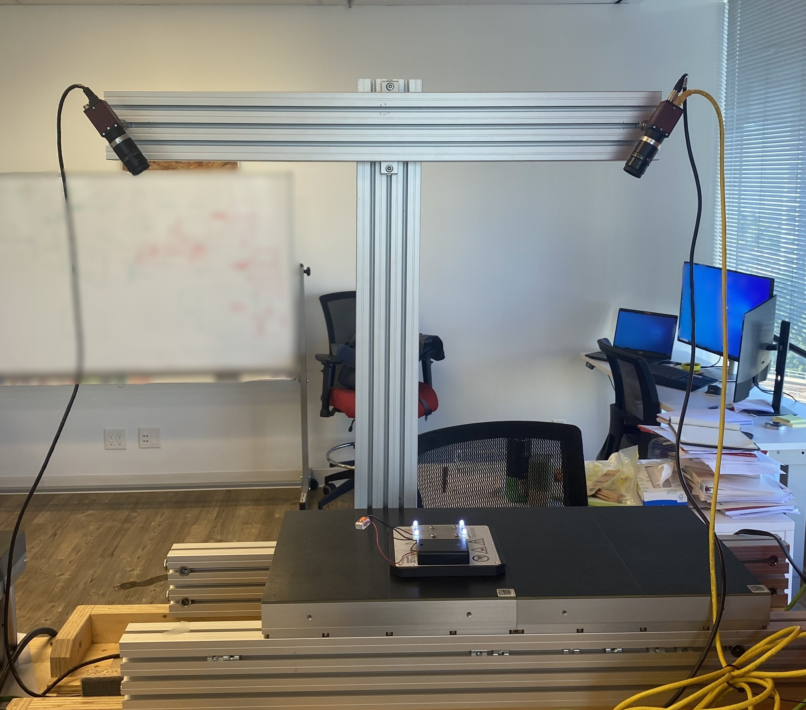

# Beckhoff XPlanar 6DOF Position Measurement Tool

A custom stereovision tracking system designed to measure the 6-Degrees-of-Freedom (6DOF) pose of a Beckhoff XPlanar mover in real time.

---

## 🎯 Objectives
The primary objective of this project is to measure the 6DOF pose of a Beckhoff XPlanar mover using a custom stereovision tracking system. To preserve strict real-time compatibility and avoid external hardware bottlenecks, all computer vision and estimation algorithms are developed and executed directly within the **TwinCAT PLC** environment. 

---

## 🏆 Outcomes & Contributions
* **Deterministic Integration:** Minimizes communication latency between the vision system and the motion controllers, allowing the 6DOF data to be utilized efficiently in deterministic control loops.
* **High-Precision Tracking:** Achieves high-precision tracking metrics across all 6 degrees of freedom with micrometer precision in translational position and milliradian precision in rotational position.

---

## ⚙️ Technical Details & Skills
The physical and software architecture relies on tight integration between industrial hardware and native TwinCAT libraries:

* **TwinCAT Vision & PLC:** Stereovision algorithms executed directly within the TwinCAT environment, processing dual-camera inputs on the industrial PC (IPC).
* **Hardware & Mechatronics:** A custom-built, rigid frame mounted with precise LED markers to facilitate high-contrast detection.
* **Skills Utilized:** Embedded Computer Vision, Real-Time Systems, Industrial Automation (Beckhoff TwinCAT), Spatial Kinematics, Hardware Integration.

---

## 🖼️ Visuals

  
   
  <em>Figure 1: LED Frame Mounted on the XPlanar Mover.</em>

  
   
  <em>Figure 2: Full Stereovision Camera Setup.</em>

